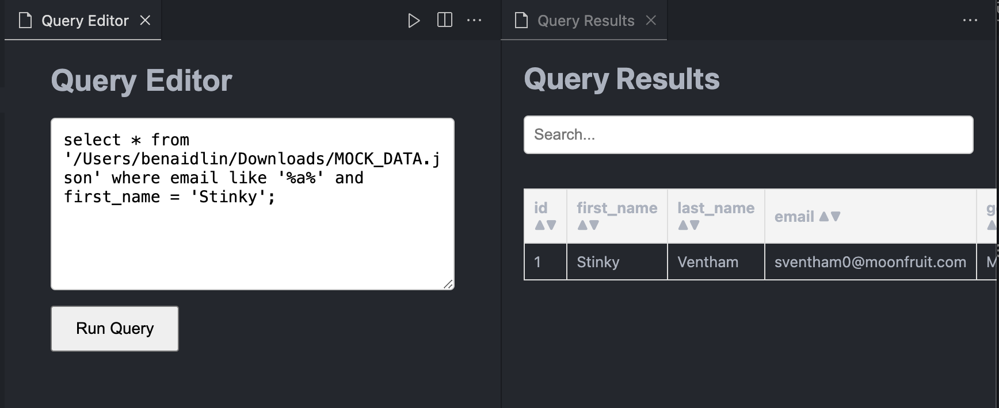
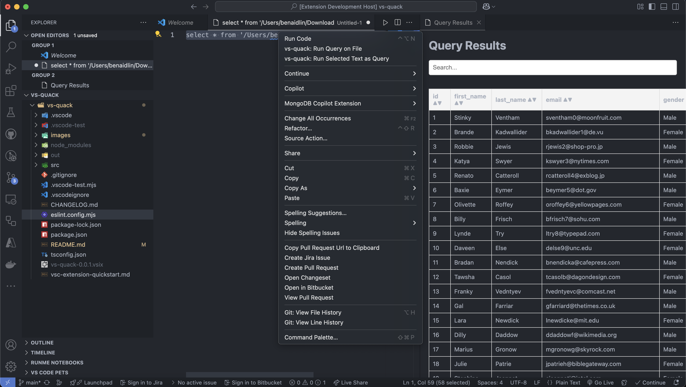
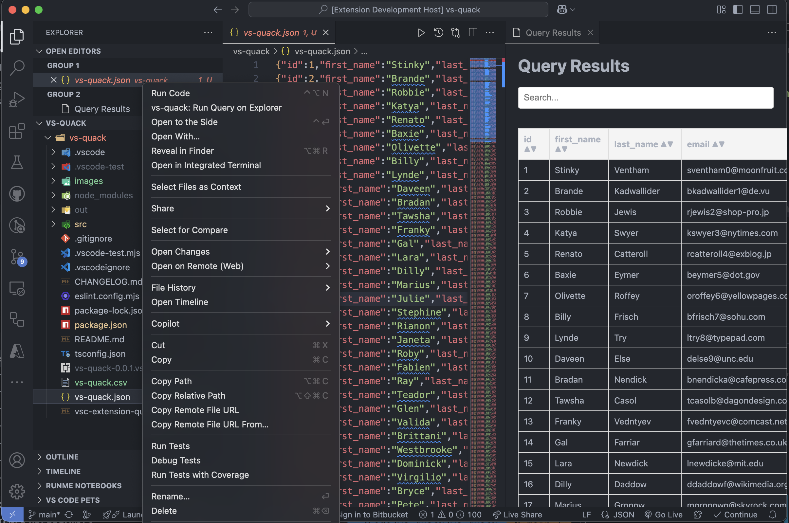

# vs-quack

vs-quack is a DuckDB based data processing tool for vs code.

## Features

First - if you are already using duckdb and have a .duckdbrc file or other config file in use, please configure it using Set DuckDb Settings in the command palette.

Next - go ahead and start querying you data using duckdb queries.

Querying from a prompt:

Querying from the editor:

Querying from the explorer:

## Requirements

vscode in version 1.97 or higher.

## Extension Settings

## Known Issues

There is no limitation on returning results size/ nor db size - which passes the responsibility to the querying user.

## Release Notes

### 0.0.1

Initial release of vs-quack. Simple querying capabilities.

### 0.0.2

* Added csv, json export options. 
* Added querying from explorer option for csv/json/parquet files.
* Added option to query from editor.
