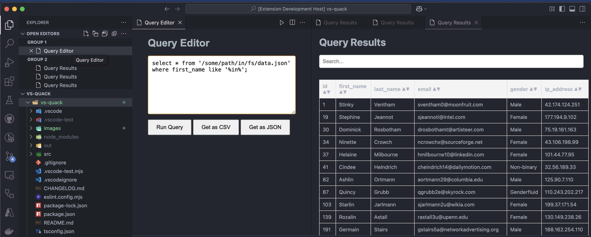
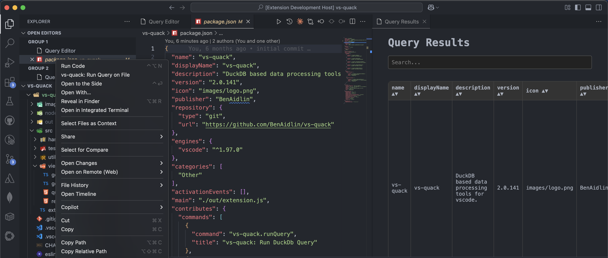
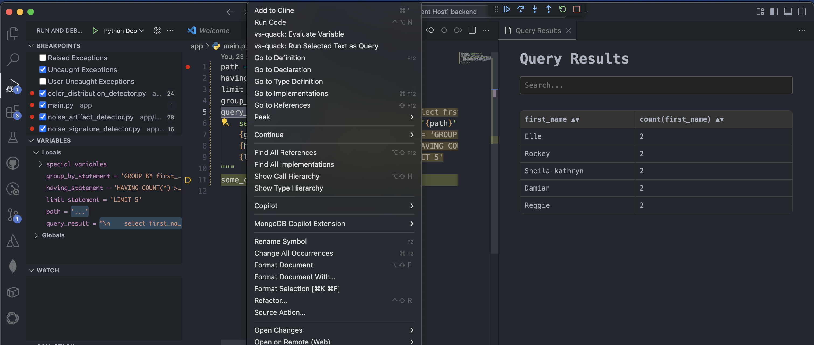

# vs-quack

vs-quack is a DuckDB based data processing tool for vs code.

## Features

First - if you are already using duckdb and have a .duckdbrc file or other config file in use, please configure it using `vs-quack: Set DuckDb Settings` in the command palette.

Next - go ahead and start querying you data using duckdb queries.

Querying from a prompt (`vs-quack: Run DuckDb Query` in the command palette):

Querying from the editor (right click in editor -> `vs-quack: Run Selected Text as Query`):

Querying from the explorer(right click with explorer focus -> `vs-quack: Run Query on Explorer`):

Evaluating from a variable name is now also possible through either code lense or right click -> `vs-quack: Evaluate Variable`:

Choosing a file and running an empty query on it can be done using: `vs-quack: Choose file` - this can be used as parquet, csv or json preview tool.

You can also view the query history (up to 50 queries), filter them, and open them in editor, using: `vs-quack: Show Query History`.

## Requirements

vscode in version 1.97 or higher.

## Extension Settings

## Known Issues

* There is no limitation on returning results size/ nor db size - which passes the responsibility to the querying user. (SOLVED v.2*)
* There are also no memory limits or CPU limits build in the extension.
     
   However - these can be easily handled using the duckdb settings file option

## Release Notes

### 0.0.1

Initial release of vs-quack. Simple querying capabilities.

### 0.0.2

* Added csv, json export options.
* Added querying from explorer option for csv/json/parquet files.
* Added option to query from editor.

### 1.0.0

* Added query history capabilities.
* Open query editor in editor/explorer queries.

### 1.0.1

* BUGFIX: Fixed settings not preserving issue.
* Persisted in memory connection while extension is activated.

### 1.1.130

* update to duckdb 1.3.0.
* change versioning strategy to show which duckdb version is utilized.

### 2.0.141

* update to duckdb 1.4.1
* change view to be consistent with vscode style.
* results query panels don't pile up, keeps only 1 results panel.
* limit to top 200 bottom 200 results.
* don't open query window when querying text from editor.

### 2.1.141

* added option to evaluate query variables while debugging.
* added "Choose file" option.
* moved row limitation to reader - 500 limit from the top.
