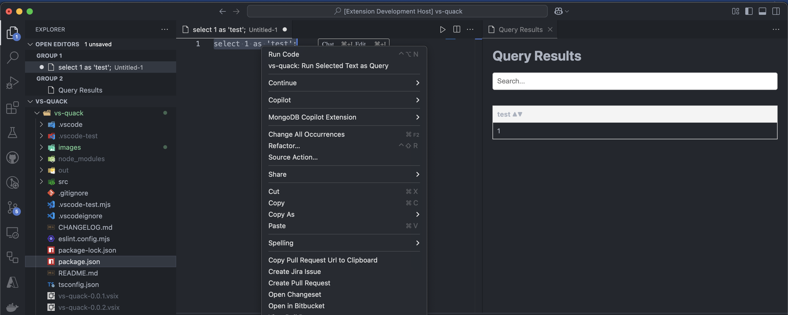
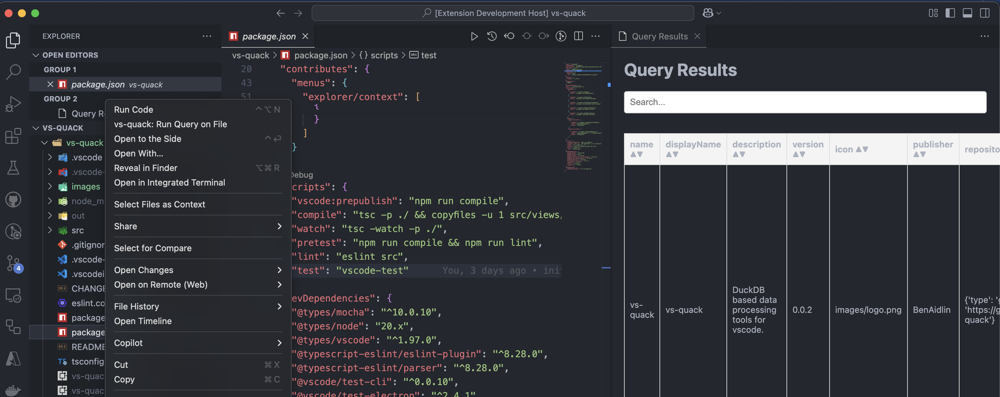

# vs-quack

vs-quack is a DuckDB based data processing tool for vs code.

## Features

First - if you are already using duckdb and have a .duckdbrc file or other config file in use, please configure it using `vs-quack: Set DuckDb Settings` in the command palette.

Next - go ahead and start querying you data using duckdb queries.

Querying from a prompt (`vs-quack: Run DuckDb Query` in the command palette):

Querying from the editor (right click in editor -> `vs-quack: Run Selected Text as Query`):

Querying from the explorer(right click with explorer focus -> `vs-quack: Run Query on Explorer`):

You can also view the query history (up to 50 queries), filter them, and open the in editor, using: `vs-quack: Show Query History`.

## Requirements

vscode in version 1.97 or higher.

## Extension Settings

## Known Issues

There is no limitation on returning results size/ nor db size - which passes the responsibility to the querying user.

## Release Notes

### 0.0.1

Initial release of vs-quack. Simple querying capabilities.

### 0.0.2

* Added csv, json export options.
* Added querying from explorer option for csv/json/parquet files.
* Added option to query from editor.

### 1.0.0

* Added query history capabilities.
* Open query editor in editor/explorer queries.
